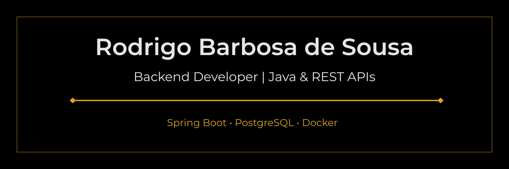

  

# 👋 Olá, eu sou Rodrigo Barbosa de Sousa

**Desenvolvedor Java Full Stack Jr.**
Estudante de Ciência da Computação e Estagiário de TI no Instituto Municipal de Planejamento Urbano (IMPLURB).

Tenho foco em desenvolvimento **Backend e Full Stack** com Java, Spring Boot, Quarkus, APIs REST, PostgreSQL, Docker, JPA/Hibernate, React, Angular e Thymeleaf.

Atualmente venho construindo projetos práticos para fortalecer meu portfólio, aplicando boas práticas de desenvolvimento, organização em camadas, versionamento com Git/GitHub, documentação técnica e integração entre backend e frontend.

---

## 🚀 Stack principal

### Backend

Java • Spring Boot • Quarkus • APIs REST • JPA/Hibernate • Maven

### Banco de dados

PostgreSQL • MySQL • H2

### Frontend

React • Angular • Thymeleaf • HTML • CSS • JavaScript • Bulma CSS

### Ferramentas

Git • GitHub • Docker • Docker Compose • IntelliJ IDEA • VS Code • Linux • Windows

### Testes e qualidade

JUnit • Mockito • Clean Code • SOLID • Design Patterns

---

## 📌 Projetos em destaque

### 🔹 Portfólio Java Full Stack

Portfólio profissional com meus principais projetos, tecnologias, trajetória e formas de contato.

**Tecnologias:** Java • Spring Boot • Thymeleaf • Bulma CSS • Docker
**Repositório:** [rodrigobsjava.github.io](https://github.com/rodrigobsjava/rodrigobsjava.github.io)

---

### 🔹 Mão Solidária System

Sistema Full Stack para apoio à organização de famílias, entregas e dashboard de controle.

**Tecnologias:** Java • Spring Boot • React • PostgreSQL • Bulma CSS
**Repositório:** [mao-solidaria-system](https://github.com/rodrigobsjava/mao-solidaria-system)

---

### 🔹 Order Management API Quarkus

API REST desenvolvida com Java e Quarkus para gerenciamento de produtos/pedidos, com foco em backend moderno e organização de endpoints.

**Tecnologias:** Java • Quarkus • APIs REST • Maven
**Repositório:** [order-management-api-quarkus](https://github.com/rodrigobsjava/order-management-api-quarkus)

---

### 🔹 ToDoList Full Stack

Aplicação Full Stack para gerenciamento de tarefas, com backend em Spring Boot, frontend em Angular e persistência em PostgreSQL.

**Tecnologias:** Java • Spring Boot • Angular • PostgreSQL
**Repositório:** [todolist-fullstack](https://github.com/rodrigobsjava/todolist-fullstack)

---

### 🔹 Validador de Senha API

API REST para validação de força de senha, aplicando regras de negócio, critérios de segurança e retorno estruturado para consumo por frontend.

**Tecnologias:** Java • APIs REST
**Repositório:** [validador-senha-api](https://github.com/rodrigobsjava/validador-senha-api)

---

### 🔹 Corporate Bookmark Installer

Ferramenta em Java para instalação e padronização de favoritos corporativos em navegadores, inspirada em necessidades reais de suporte técnico.

**Tecnologias:** Java • Automação • Ambiente Corporativo
**Repositório:** [corporate-bookmark-installer](https://github.com/rodrigobsjava/corporate-bookmark-installer)

---

## 📚 Atualmente estudando

* Java avançado
* Spring Boot
* Quarkus
* APIs REST
* JPA/Hibernate
* Testes com JUnit e Mockito
* Docker
* PostgreSQL
* React e Angular
* Clean Code, SOLID e Design Patterns

---

## 🎯 Objetivo profissional

Busco oportunidades como **Desenvolvedor Java Backend Jr.** ou **Desenvolvedor Java Full Stack Jr.**, contribuindo com organização, aprendizado contínuo, clareza técnica e entrega de soluções úteis.

---

## 📫 Contato

* **LinkedIn:** [linkedin.com/in/rodrigo-java](https://www.linkedin.com/in/rodrigo-java/)
* **Portfólio:** [rodrigobsjava.github.io](https://rodrigobsjava.github.io)
* **GitHub:** [github.com/rodrigobsjava](https://github.com/rodrigobsjava)
* **Email:** [rodrigo.barbosa.sousa.pro@gmail.com](mailto:rodrigo.barbosa.sousa.pro@gmail.com)

